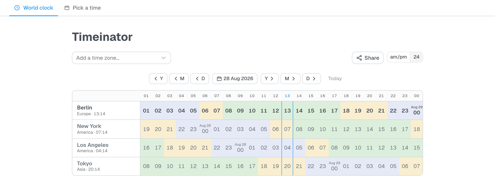
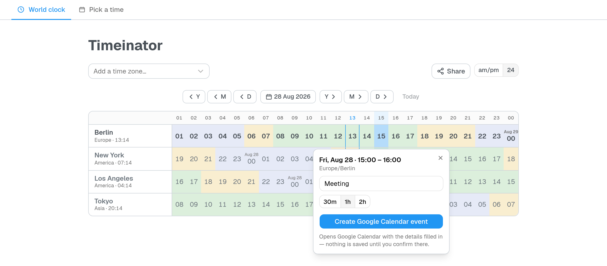
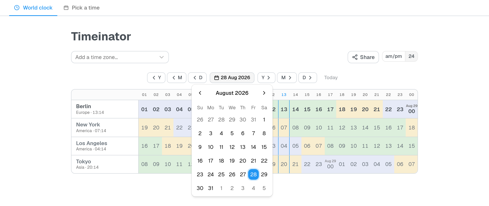
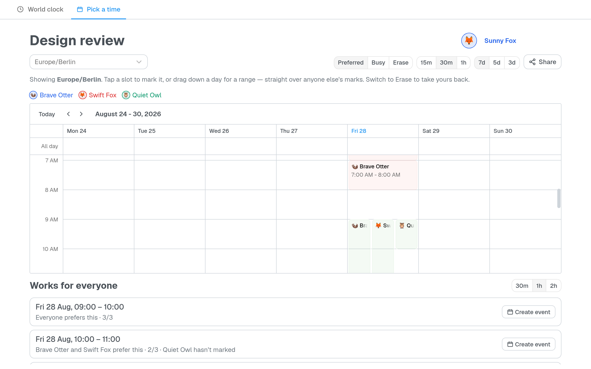
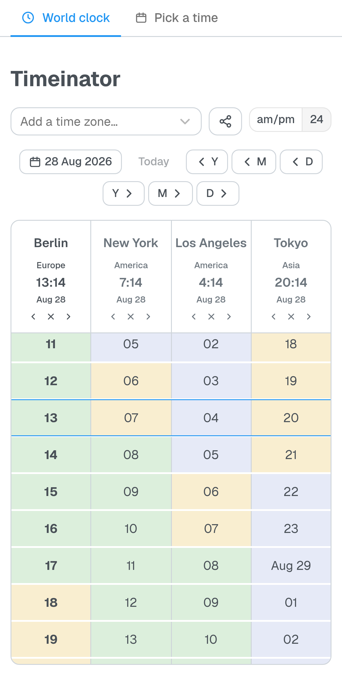
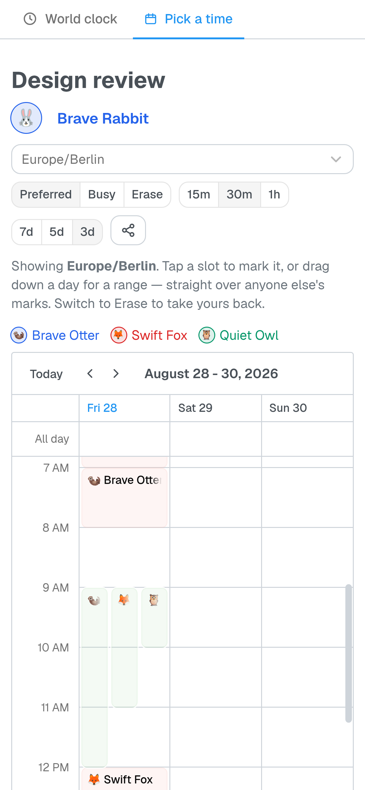

# Timeinator

A world clock and a group scheduler. Self-hosted, no accounts, and all of its
state is one SQLite file.

Live at **[timeinator.frrcode.com](https://timeinator.frrcode.com)**.
Developed by [frrcode](https://frrcode.com).
More on the [about page](https://apps.frrcode.com/en/timeinator/).



## World clock

Add the zones you care about. Each row is a zone, each column an hour, and every
cell is coloured by how reasonable that hour is where it lands: green for the
working day, yellow either side of it, blue for the night. Scan a column and you
can see who is awake.

The blue column is now. Hover one to trace a single moment across every zone.

Click a cell and you get a Google Calendar link with the time already filled in,
plus a description listing that slot in every zone you are watching, so nobody
has to do the conversion twice. Nothing is written to your calendar; Google opens
its own compose screen.

Your zones live in the URL, so sending someone the link sends them your lineup.
Step through dates by year, month or day, or jump straight to one.

<p align="center">
  
  &nbsp;
  
</p>

## Pick a time

For when you need an hour that suits several people in different places.

Open `/pick`, mark up your week, send the link. Everyone paints their own
availability in their own time zone: red for busy, green for preferred. Tap a
slot, drag down a day for a range, or pull the edge of one of your blocks to
stretch it. Your marks show at full strength and everyone else's are faded, so
you can tell what you said from what you are being told.

Underneath is the list that matters: the windows where nobody is busy, best
first, naming who wants each one and who has not answered yet.

Show seven days, five or three, at fifteen-minute, half-hour or hourly
resolution. Both controls work the same on a laptop and a phone; the phone just
starts at three days because seven columns there are about fifty pixels each.



There is nothing to sign up for. You arrive with a name like *Brave Otter*, which
you can change, and your browser remembers you. Anyone holding the link can join,
which is the point of a link you paste into a group chat.

## On a phone

The clock turns sideways: zones become columns, hours become rows, and the zone
headers stay put while you scroll.

<p align="center">
  
  &nbsp;&nbsp;
  
</p>

Both pages install as a PWA. The world clock works offline; Pick a time needs the
network, since the poll lives on the server.

## Running your own

You need **Node 24** and **pnpm**. Docker is optional. There is no build step for
the server and nothing to compile: Node runs the TypeScript directly and stores
polls through its own `node:sqlite`.

```bash
pnpm install
pnpm dev      # client on :4001, API on :4002
```

```bash
pnpm build
pnpm start    # one process, serving both, on PORT (4002)
```

`pnpm test`, `pnpm check` and `pnpm fix` do what you would expect, and `just`
wraps all of it if you prefer.

### The data

Everything is in `$DATA_DIR/timeinator.db`, `./data` by default. Copy that file
and you have copied the whole application state.

`GET /api/health` returns `{"status":"ok","polls":N}`. It reads the database to
answer, so it returns 503 if the volume is missing or unwritable rather than
claiming to be fine.

### Deploying

One Docker image holds the built app and the API, served by a single process.
There is no separate web container because there is nothing for one to do.

```bash
just docker-run                  # build and run it locally on :4002
just deploy                      # build, ship over ssh, restart
DEPLOY_HOST=my-server just deploy
```

`scripts/deploy.sh` sends the image straight to the host with
`docker save | ssh docker load`. No registry, since for one box that is more
moving parts than the thing being deployed. It tags with the commit hash and
refuses a dirty tree.

It will not touch your compose file or reverse proxy config, because those
usually carry other projects. Set those up once: a service using the image with
`./data/timeinator:/data` mounted, and a proxy rule pointing at its port. Or skip
Docker entirely and run `pnpm build && pnpm start` behind whatever you already
use.

### Making it yours

Names, colours, the canonical URL and the social card all come from
`src/lib/consts.ts`, and every one has a build-time override:

```bash
cp .env.example .env.local    # set VITE_SITE_URL to your host
pnpm build
```

`.env.example` lists the rest.

### Screenshots

`pnpm build && pnpm screenshots` regenerates `docs/screenshots/`. It drives
whatever Chromium you already have, seeds a poll so the shots have something in
them, and cleans up after itself.

## If you are reading the code

Times are stored as UTC seconds, never wall clocks. That is what lets one person
mark 14:00 in Berlin and another see the same block at 08:00 in New York.

`shared/` holds the interval maths and is imported by both the browser and the
server, so the two cannot disagree about what overlapping means.

`src/components/ui` and `src/components/reui` are vendored from the
[shadcn](https://ui.shadcn.com) and [ReUI](https://reui.io) registries. They are
checked in on purpose; that is how those registries work.

React 19, Vite, Tailwind and dayjs on the client. Hono and `node:sqlite` on the
server. Biome and Vitest.

## License

[ISC with the Commons Clause](LICENSE).

Use it, fork it, restyle it, run it for yourself or for everyone at work. No fee
and no permission needed. Keep the licence notice if you pass it on.

You may not sell it: no hosted version, no paid fork, no billing a client for
running it on their behalf. If you want to do that, ask at
[frrcode.com](https://frrcode.com).

The Commons Clause makes this source-available rather than open source in the OSI
sense. The [LICENSE](LICENSE) is short if that distinction matters to you.

---

Developed by **[frrcode](https://frrcode.com)**.
Source on [GitHub](https://github.com/FrrCode/Timeinator) ·
[About](https://apps.frrcode.com/en/timeinator/)
